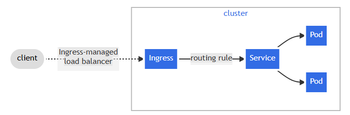

# Kubernetes Learning Notes

## 1. What is Kubernetes?

Kubernetes is an open-source platform for automating deployment, scaling, and management of containerized applications. 

Key features:
- Automates deployment and management of containerized apps
- Provides scaling capabilities
- Handles high traffic loads by distributing across multiple servers
- Prevents downtime through self-healing and load balancing

## 2.Kubernetes Orchestration

Kubernetes acts as a conductor/orchestrator that controls the behavior of all container-based running applications, similar to how a band master coordinates musicians.

## Kubernetes Cluster

When we deploy Kubernetes, we get a cluster consisting of:

1. **Master Node**:
   - Uses API server to manage worker nodes
   - The control plane that makes global decisions

2. **Worker Nodes**:
   - Can be virtual or physical machines
   - Run the actual containerized applications

**Cluster**: A group of nodes (workers) managed by the master.
### Listing Nodes
 - To view all nodes in your Kubernetes cluster, you can use the
 -  ```
    kubectl get nodes
    ```
   - Command. Adding the -o wide option will give you more detailed information, such as the internal and external IP addresses of the nodes, the operating system image, the kernel version, and the container runtime version used on each node.

### Describing a Node
 - For a more detailed view of a specific node, use the
 -  ```
    kubectl describe node NODE_NAME
    ```
   - command. This provides additional information such as labels, annotations, taints, a list of running pods on that node, allocated resources, and recent events related to that node.

### Draining a Node
 - When you need to perform maintenance on a node (such as installing updates or software), it's best to first drain the node. Draining means safely evicting all the pods from the node so that it can be updated without affecting the workload. You can do this using the command
 -  ```
    kubectl drain NODE_NAME
    ```


## Kubernetes Components

Core components include:
- API server
- Container Runtime
- ETCD (key-value store)
- Kube Proxy
- Scheduler
- Kubelet
- Kube Controller

## Administration/Architecture

Key architectural elements:
- API
- Namespaces
- PODs
- Deployments
- ReplicaSets
- StatefulSets
- DaemonSets
- Services
- Ingress Controllers
- ConfigMaps
- Secrets
- Storage
- Role Based Access Control (RBAC)
- Jobs, CronJobs
- Custom Resource Definitions (CRD)
- Helm
## Namespaces in Kubernetes
### What is a Namespace?
A namespace in Kubernetes is a way to divide cluster resources between multiple virtual clusters. In simple terms, it's like having separate compartments or environments inside a single Kubernetes cluster. You can use namespaces to logically separate and manage different sets of resources, such as development, testing, and production environments.
When you use 
- ```
  kubectl get namespaces
  ```
  you will typically see four default namespaces:
-  + default – used when no other namespace is specified.
-  + kube-system – used by Kubernetes system components.
-  + kube-public – generally readable by all users.
-  + kube-node-lease – used for node heartbeats.
- Most user-created resources live in the default namespace unless you specify otherwise.
 ### Why Use Namespaces?
 Namespaces are useful for:
 + Organizing resources into logical groups (e.g., all database-related resources in one namespace, monitoring tools in another).
+ Controlling access using role-based access control (RBAC).
+ Limiting resource usage by setting resource quotas (CPU, memory).
+ Improving clarity and manageability in large clusters with many components.
+ Over time, if all resources are created in the default namespace, it can become cluttered and difficult to manage. Using namespaces helps avoid this issue.

### Creating a Namespace
To create a namespace from the command line, use:
- ```
  kubectl create namespace my-namespace
  ```
You can also create a namespace using a configuration (YAML) file:
- ```
   apiVersion: v1
    kind: Namespace
   metadata:
   name: my-namespace
  ```
then apply is using the :
- ```
  kubectl apply -f namespace.yaml
  ```
  Using Resources Within a Namespace
When creating resources like ConfigMaps, Secrets, or Deployments, you can associate them with a namespace in two ways:
Add the ```--namespace=my-namespace``` flag while applying the resource

### Best Practices for Namespaces
- Each namespace should have its own ConfigMaps and Secrets.
- Some components in Kubernetes are global and not bound to a namespace. These include:
   - Nodes
   - Persistent Volumes
### Making a Namespace the Default (Using kubens)
- If you're working within a specific namespace frequently, it becomes repetitive to specify --namespace=my-namespace every time. Kubernetes doesn’t offer a built-in way to set a default namespace per session, but you can use a tool called kubens to make namespace switching easier.
- Once installed, simply run ```kubens``` to list all namespaces, and use:
- ```kubens my-namespace```
- This command changes the current context to use my-namespace by default, so all subsequent kubectl commands will target that namespace unless otherwise specified.

  
## PODs

- Smallest unit in Kubernetes
- An environment that runs containers inside itself
- A Pod can contain one or more containers

## 📦 ReplicaSet in Kubernetes

A **ReplicaSet** is a Kubernetes controller that ensures a specified number of pod instances are running at all times in a cluster. It provides fault tolerance and scalability by maintaining pod replicas even if some fail or get deleted.

---

### ✅ Key Features

- Ensures the **desired number of pod instances** are always running.
- Automatically **replaces failed or deleted pods**.
- Supports **scaling up/down** the number of pods.
- Enhances **high availability**, **load balancing**, and **auto-recovery**.

---

### 🚀 Why Use ReplicaSets?

| Feature        | Description                                                                 |
|----------------|-----------------------------------------------------------------------------|
| **Reliability** | Prevents application downtime by recreating failed pods.                   |
| **Load Balancing** | Distributes incoming traffic across multiple pod instances.            |
| **Scaling**     | Dynamically adjusts the number of pods based on demand or configuration.   |

---

### 🔁 Relationship with Other Kubernetes Resources

```text
Deployment → ReplicaSet → Pod(s)
```

## 🗃️ StatefulSets in Kubernetes

A **StatefulSet** is a Kubernetes controller designed specifically for managing **stateful applications**. These are applications that maintain **state information** — such as logs, session data, or user interactions — even after a restart or rescheduling.

---

### 🔄 What is a Stateful Application?

A **stateful application** is one that keeps track of the interactions, data, or changes it processes over time. Examples include:

- Databases (e.g., MySQL, PostgreSQL)
- Distributed caches (e.g., Redis, ZooKeeper)
- Messaging systems (e.g., Kafka)

In contrast, **stateless applications** do not retain data between sessions and can be deployed and destroyed freely without impacting system consistency.

---

### ⚙️ When to Use StatefulSets

- When you need **stable, unique network identifiers** per Pod.
- When each Pod needs to maintain **persistent storage** across restarts.
- When **ordered deployment, scaling, and termination** is necessary.
- When **only one pod** (the master) should be allowed to write to a shared resource while others act as slaves.

---

### 📊 Deployment vs. StatefulSet

| Feature                     | `Deployment` (Stateless)        | `StatefulSet` (Stateful)             |
|----------------------------|----------------------------------|--------------------------------------|
| **Pod Identity**           | Random                           | Sticky & Unique (e.g., pod-0, pod-1) |
| **Storage**                | Shared or ephemeral              | Persistent volume per pod            |
| **Scaling**                | Any order                        | Ordered (1, 2, 3...)                 |
| **Pod Replacement**        | Random                           | Identical pod name restored          |
| **Use Case**               | Web servers, APIs, microservices | Databases, queues, clustered systems |

> ⚠️ **Why Identity Matters**:  
When multiple Pods try to write to shared data, inconsistency may arise. StatefulSets allow only **one pod (master)** to perform such writes while others (slaves) read or remain passive, maintaining consistency and reliability.

---

### 🧪 Example Use Case

Deploying a clustered database like Cassandra, Kafka, or MongoDB that requires:

- Unique Pod names
- Persistent volume claims (PVCs)
- Pod startup/shutdown in a defined order

---

### 📝 Summary

- Use `StatefulSet` for **stateful, ordered, and identity-aware workloads**.
- Use `Deployment` for **stateless and scalable workloads**.
- Always ensure **proper volume management and configuration** when working with StatefulSets.
---
## 🌐 Kubernetes Services

In Kubernetes, **Services** provide a stable network endpoint to access Pods. Since Pods can come and go (due to restarts, scaling, etc.), Services ensure that communication within and outside the cluster remains consistent and reliable.

---

### 🧩 Why Use Services?

- 🔁 **Stable IP Address**: Pods have dynamic IPs, but a Service has a **stable** one.
- ⚖️ **Load Balancing**: Distributes traffic across multiple Pods.
- 🔓 **Loose Coupling**: Decouples clients from Pods, simplifying discovery and communication.
- 🌍 **Access Control**: Controls access within and outside the cluster.

---

### 🧭 Types of Kubernetes Services

### 1. 📦 ClusterIP (Default)

> **Internal communication only**

- Exposes the service **internally** to other components **within the cluster**.
- Best suited for microservices that communicate with each other inside Kubernetes.

🔸 **Use Case**: Service-to-service communication (e.g., frontend to backend).

### 2. Headless service
> **Direct access to individual Pods**
> **what if client wants to communicate with specific pod**
> **pod want to talk directly**
> **so we can not choose randomly**
> **use case : stateful application like database**
- Set ClusterIP: None to create a Headless Service.
- Does not use a virtual IP, but returns the Pod IPs directly.
- Useful when the client needs to connect to individual Pods, not load-balanced traffic.

### 3. 🚪 NodePort
> **Expose Pods on a static port across all nodes**
> *this makes the external traffic access to fixed port on worker node*
- Makes the service accessible outside the cluster using NodeIP:NodePort.
- Opens a fixed port (e.g., 30000–32767) on every Node in the cluster.
- 🔸 Use Case: Basic external access to applications, useful for testing or small-scale apps.
### 4. 🌍 LoadBalancer
> **Cloud-integrated external access**
> *the service becomes accessible to the external using cloud*
- Automatically provisions an external load balancer from the cloud provider.
- Routes traffic to your app through the Service, balancing across Pods.
- 🔸 Use Case: Production-grade apps needing external access in cloud environments (GCP, AWS, Azure).
### 📌 Best Practices
- + Use ClusterIP for most internal services.
- + Use Headless with StatefulSets for databases or clustered systems.
- + Use NodePort for basic testing.
- + Use LoadBalancer for production services in cloud environments.
 
    
## **Benefits of Kubernetes**
- Set ```ClusterIP: None``` to create a Headless Service.
- Does not use a virtual IP, but returns the Pod IPs directly.
- Useful when the client needs to connect to individual Pods, not load-balanced traffic.
- Container Orchestration
- Scalability
- Load Balancing
- High Availability
- Rollouts and Rollback capabilities

## Getting Started with Minikube

Minikube is used to learn Kubernetes without connecting to cloud services.

### Basic Commands

```
# Start Minikube
minikube start
```
```
# Stop Minikube
minikube stop
```
```
# Delete Minikube cluster
minikube delete
```
```
# Check status
minikube status
```
### Create the Pod
```
# Create stabd alone pods
kubectl run my-ngnix --image=ngnix:latest
```
```
# Create deployment
kubectl create deployment my-ngnix --image=ngnix:latest
```
```
kubectl create deployment my-app --image=appname
```
if its in docker hub then it would take from there else we need to provide the complete path

### List all Kubernetes Deployments
```
kubectl get deployments
```
This would give the output as:
| NAME      | READY | UP-TO-DATE | AVAILABLE | AGE |
|-----------|-------|------------|-----------|-----|
| my-nginx  | 1/1   | 1          | 1         | 2m  |

Where Each column hold the information of Pod
| Column | Description |
| -------------- | ------------------------------------------------------------- |
| **NAME** | The name of the deployment (e.g., `my-nginx`) |
| **READY** | How many pods are ready vs. how many are expected (e.g., 1/1) |
| **UP-TO-DATE** | Number of pods updated to the latest deployment configuration |
| **AVAILABLE** | Number of pods available to serve requests |
| **AGE** | How long ago the deployment was created |

### List all running PODS
```
kubectl get pods
```

### Web-based UI to manage and monitor the local minikube cluster

```
minikube dashboard
```

### Provide The service
 - A Service is an abstraction that exposes a set of Pods as a network service. Even if Pods die and get replaced, the service keeps the same DNS name and IP.

- To expose a service for your application in Kubernetes, you can use the following command:

```
kubectl expose deployment my-nginx --port=80 --type=LoadBalancer
```
- In Kubernetes, Pods are temporary and dynamic — they can be killed, restarted, or rescheduled at any time. That means:
    - 🔁 **Pod IP addresses can change**: When a Pod is rescheduled or recreated, its IP address may change.
    - ❌ **You can't rely on a Pod’s IP to reach your app consistently**: Since Pods are ephemeral, their IPs are not stable.
    - 🧭 **There’s no built-in way to route traffic to your app**: Without a service, it’s difficult to ensure that traffic is routed to the correct Pod, especially when Pods are constantly changing.
- Real-World Analogy for Service Providing
- Imagine a **restaurant kitchen** (representing Pods) where cooks change daily. Customers (users) don’t remember which cook is working — they just order from the **counter** (representing the **Service**), which always knows where the cooks are.
   -  **Pods** are like the cooks: Their IPs can change or be replaced.
   -  **Services** are like the counter: They provide a stable endpoint to reliably serve customers, even if the cooks (Pods) change.


### Run pod in local browser
```
minikube service my-nginix 
```
- this command is used to access a Kubernetes service running in your Minikube cluster from your local machine's browser. When you run minikube service my-nginx, Minikube will:
 + ***Open a Tunnel/Proxy***: It starts a local proxy to the service running inside Minikube.
 + ***Open the Web Browser***: It will automatically open the service in your default web browser.
 + ***Access the Service***: You can now interact with the service (e.g., a web app like NGINX, database, etc.).

### Delete POD:
```
kubectl delete deployment my-app
```

### List all service in Kubernetes cluster
```
kubectl get services
```
- This command lists all the services in your Kubernetes cluster. Services in Kubernetes provide a stable network endpoint for accessing a set of Pods (containers), and they can route traffic to the appropriate Pod(s) based on the service type (e.g., ClusterIP, NodePort, LoadBalancer, etc.).

---

## 🌐 Kubernetes Ingress Guide

Ingress is a powerful Kubernetes resource that manages external HTTP/S access to services within your cluster. Instead of exposing each service individually, you can use Ingress to centralize and simplify traffic routing.

---

### ✅ Purpose of Ingress

In Kubernetes, **Ingress** is used to:
- Manage **external access** to services (HTTP/HTTPS).
- Route **incoming traffic** based on hostname or path.
- Provide a **central point** for managing routing rules and TLS termination.

---

## 🧭 Key Features

### 🌍 Expose Services to the Internet
Ingress makes it easy to expose multiple internal services behind a single IP and domain.

### 🔀 Routing Rules
You can route traffic based on:
- Hostnames (e.g., `api.example.com`)
- Paths (e.g., `/api`, `/admin`)

### ⚖️ Load Balancing
Ingress controllers can distribute HTTP traffic across service pods.

### 🧩 Centralized Traffic Management
Configure all traffic-related rules (routing, TLS, etc.) in one place using the Ingress resource.

---

### 🛠️ Common `kubectl` Commands for Ingress

### 1. ✅ Check All Ingress Resources
```bash
kubectl get ingress
kubectl get ing             # shorthand
kubectl get ing -A          # view across all namespaces
```
### 2. 🔍 Describe an Ingress Resource
```bash
kubectl describe ingress <ingress-name>
```
### 3. 📄 View Ingress as YAML
```bash
kubectl get ingress <ingress-name> -o yaml
```
### 4. 🆕 Create an Ingress from a YAML File
```bash
kubectl apply -f ingress.yaml
```
### 5. 🛑 Delete an Ingress

```bash
kubectl delete ingress <ingress-name>
```
### 📸 Diagram




--- 

## 🔧 Kubernetes ConfigMap vs 🔐 Secret

Kubernetes provides **ConfigMap** and **Secret** to inject configuration and sensitive data into pods. Here's a brief comparison and usage guide.

---

### ✅ Purpose

| Resource     | Description                                                                  |
|--------------|------------------------------------------------------------------------------|
| **ConfigMap** | Used to store **non-sensitive configuration data** as key-value pairs.        |
| **Secret**    | Used to store **sensitive data** such as passwords, tokens, and API keys.     |

---

### 🧩 Key Differences

| Feature            | ConfigMap                          | Secret                              |
|--------------------|------------------------------------|--------------------------------------|
| **Use Case**        | App settings, log levels, etc.     | Passwords, API keys, certificates    |
| **Data Format**     | Plaintext                         | Base64-encoded (can be encrypted)    |
| **Security Level**  | Low                               | Medium (RBAC + optional encryption)  |
| **Mountable**       | Yes (as env vars or volumes)      | Yes (as env vars or volumes)         |
| **Readable By**     | Anyone with pod access            | Restricted via RBAC                  |

---

### 📄 ConfigMap Example

```yaml
apiVersion: v1
kind: ConfigMap
metadata:
  name: my-config
data:
  APP_ENV: "production"
  LOG_LEVEL: "info"
```
### 🔐 Secret Example
```yaml
apiVersion: v1
kind: Secret
metadata:
  name: my-secret
type: Opaque
data:
  DB_PASSWORD: cGFzc3dvcmQ=  # base64 for "password"
```
### 📌 Summary Table

| Feature       | ConfigMap              | Secret                        |
|---------------|------------------------|-------------------------------|
| **Type**      | Non-sensitive config   | Sensitive data                |
| **Format**    | Plain text             | Base64 (optionally encrypted) |
| **Usage**     | Env vars, volumes      | Env vars, volumes             |

--- 
## Kubernetes Volume – Explained

### How to persist data in Kubernetes using volumes?

#### Three components of Kubernetes Storage:
1. Persistent Volume
2. Persistent Volume Claim
3. Storage Class

### Why?

For instance, when we update data onto an application, and that application is running on pods, the data will be lost if the pod dies and we restart the application. So it's important to ensure we have **storage that doesn't depend on the pod lifecycle**.

But we are not aware of which node will be active to fetch data from the storage, so we need to give **storage access on all nodes**.

And what if the whole cluster crashes? We still need to make sure that the **storage should survive the cluster crash**.

Key requirements:
1. Storage should not be dependent on pod lifecycle  
2. Storage should be available on each node  
3. Storage should survive the cluster crash  

---

### 1. Persistent Volume

**PersistentVolume (PV):** The actual physical or virtual storage in the cluster.

A Persistent Volume (PV) is a piece of storage in your cluster that has been provisioned by an administrator or dynamically created using Storage Classes. It allows data to persist beyond the lifecycle of a Pod.

We create this using a YAML file and we add:
- `kind: PersistentVolume`
- `spec:` (storage, access mode, ...)

Since the Persistent Volume is abstract, it would need direct physical storage to operate.

### Who creates it and when?

The Kubernetes Administrator is responsible for making sure there are enough resources for the cluster to run. They maintain the cluster and its resources, so their task is to create and manage the storage.

The developer must communicate what type of data storage is needed (e.g., Google Cloud Storage). The administrator would then create the resource (e.g., Google storage volume). However, the application must also be able to access it. So, the application needs to claim that volume, and the developer must create a YAML file to claim the Persistent Volume.

---

### 2. Persistent Volume Claim (PVC)

**PersistentVolumeClaim (PVC):** A request for storage by a user or pod (like a ticket to use a PV).

A PersistentVolumeClaim (PVC) is a request for storage by a user or a pod. It's how you bind to a PersistentVolume (PV) in Kubernetes. The PVC describes the amount of storage, access mode, and optionally, a StorageClass.

### 📌 How It Works:
- A PVC is created requesting 1Gi storage and ReadWriteOnce access.
- Kubernetes looks for a suitable PV that matches the request.
- If found, it binds the PVC to that PV.
- You can then use the PVC in a pod to mount the storage.

---

### 3. Storage Class

Let’s imagine there are hundreds of applications running daily and we need resources for all of them. The developer would reach out to the administrator, who would create the PV (Persistent Volume). Then the developer would make the PVC (Persistent Volume Claim) and use it.

But this is tedious and manual, so to automate it we have **Storage Class**.

A StorageClass defines how storage is provisioned in a Kubernetes cluster. It allows you to dynamically provision PersistentVolumes (PVs) when a PersistentVolumeClaim (PVC) is created — eliminating the need to pre-create PVs manually.

---

### ✅ Why Use StorageClass?
- Automates volume provisioning  
- Supports different storage types (SSD, HDD, network volumes, etc.)  
- Enables faster and scalable storage allocation  
- Useful in cloud environments (e.g., AWS EBS, GCP Persistent Disk, Azure Disk)  

---

### 🧱 Key Components

| Element            | Description                                                  |
|--------------------|--------------------------------------------------------------|
| Provisioner        | Determines the type of backend storage (e.g., kubernetes.io/aws-ebs) |
| Parameters         | Backend-specific configuration (e.g., type, zones)           |
| ReclaimPolicy      | What to do with storage when PVC is deleted (Retain, Delete) |
| VolumeBindingMode  | When volume binding and provisioning happens                 |

---

### 🗂️ Example Flow
1. Admin creates a PV (or it's dynamically created).  
2. User/app defines a PVC requesting storage (e.g., 5Gi).  
3. Kubernetes binds the PVC to a matching PV.  
4. The pod uses the PVC to mount the storage.

---


## 🔐 Kubernetes RBAC (Role-Based Access Control)

RBAC (Role-Based Access Control) is a Kubernetes method for regulating access to resources based on the roles of individual users or applications within a cluster.

---

### ✅ Purpose of RBAC

RBAC is used to define **who can do what** in your Kubernetes cluster. It allows fine-grained control over:

- **Who** (user, group, or service account)
- **Can perform what action** (get, list, create, delete, etc.)
- **On which resource** (pods, services, secrets, etc.)
- **In which namespace**

---

### 🧩 Core Components of RBAC

| Component           | Description                                                       |
|---------------------|-------------------------------------------------------------------|
| `Role`              | Specifies permissions **within a namespace**.                     |
| `ClusterRole`       | Specifies permissions **across the entire cluster**.              |
| `RoleBinding`       | Grants a `Role` to a user/group/service account **within a namespace**. |
| `ClusterRoleBinding`| Grants a `ClusterRole` to a user/group/service account **across namespaces**. |

---

### 🛡️ Benefits of RBAC

- Enforces **least privilege** access
- Supports **multi-tenant** security models
- Separates concerns between **devs**, **ops**, and **apps**
- Enhances **cluster security and auditability**

---

### 🔍 Difference Between RoleBinding and ClusterRoleBinding

| Feature           | `RoleBinding`                                          | `ClusterRoleBinding`                                        |
|-------------------|--------------------------------------------------------|--------------------------------------------------------------|
| **Scope**         | Namespace-scoped                                       | Cluster-wide                                                 |
| **Binds to**      | A `Role` or `ClusterRole` within a specific namespace  | A `ClusterRole` across all namespaces                        |
| **Usage**         | Grants access **within a specific namespace only**     | Grants access **across the entire cluster**                  |
| **Typical Use**   | For access to **only one namespace**                   | For access across **all namespaces**                         |

### 🧠 **Key Rule**:
- Use `RoleBinding` when access should be limited to a **single namespace**.
- Use `ClusterRoleBinding` when access is needed across the **entire cluster**.

---

### ✅ Common Verbs in Kubernetes RBAC

`get` ,`list`,`watch`,`create`,`update`,`patch`,`delete`,`deletecollection`,`impersonate`,`bind`,`escalate`,`use`

